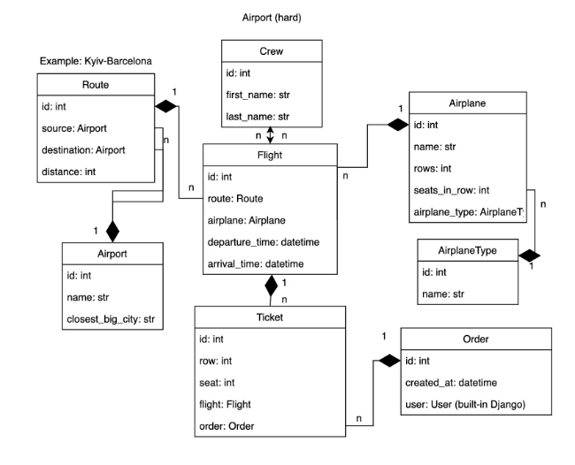

# Airport API service
## Check it out!

[Airport API service Deploying Render ](#)

## Installation

```shell
git clone https://github.com/AlyonkaB/Airport_api_service.git
cd Airport_api_service/
python -m venv venv
source venv/scripts/activate
pip install -r requirements.txt
python manage.py runserver
```

## Demo

DB structure:

